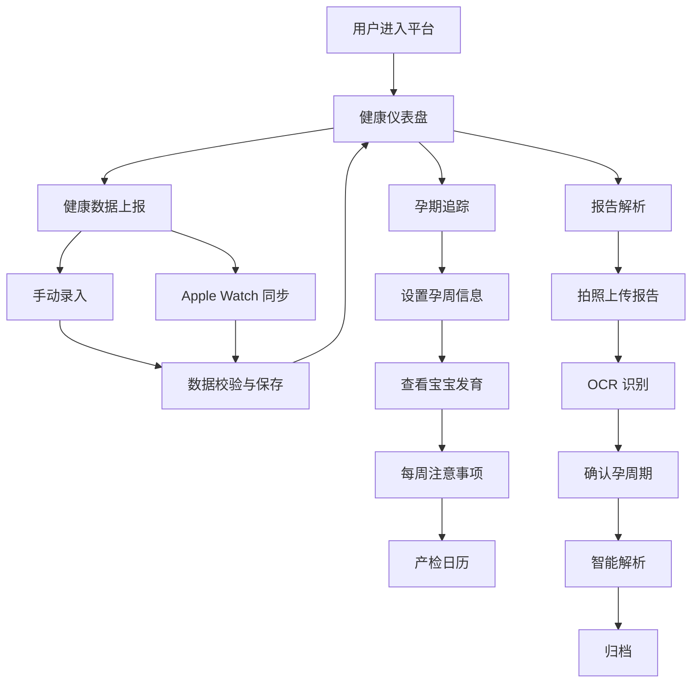

# 孕婴健康守护平台 - 产品需求文档 (PRD)

## 1. 产品概述
孕婴健康守护平台是一款面向孕产妇的综合性健康管理应用，支持 iPhone/Apple Watch 健康数据自动上报、孕期宝宝发育追踪、检查报告智能解析等核心能力。
- 解决孕产妇在孕期中对自身健康数据管理碎片化、胎儿发育信息获取分散、检查报告解读困难等痛点
- 目标用户为备孕期及孕期女性（孕1-40周），市场价值在于提供一站式孕产健康管理闭环

## 2. 核心功能

### 2.1 用户角色
| 角色 | 注册方式 | 核心权限 |
|------|----------|----------|
| 孕妈用户 | 手机号/邮箱注册 | 健康数据管理、孕期追踪、报告解析 |
| 家属用户 | 手机号注册 | 查看关联孕妈的健康数据（只读） |

### 2.2 功能模块
1. **健康仪表盘**: 综合健康数据概览、今日待办提醒、关键指标趋势图
2. **健康数据上报**: 手动录入 + iPhone/Apple Watch 自动同步心率、步数、睡眠、血氧等
3. **孕期追踪**: 孕周进度、宝宝发育状态、每周注意事项、产检时间表
4. **报告解析**: 拍照上传检查报告单、OCR 识别关键指标、智能解析与归档
5. **健康档案**: 历史数据查询、报告记录、产检时间线

### 2.3 页面详情
| 页面名称 | 模块名称 | 功能描述 |
|----------|----------|----------|
| 健康仪表盘 | 健康概览卡片 | 展示心率、步数、睡眠、血氧等核心指标实时数据 |
| 健康仪表盘 | 孕周进度环 | 可视化展示当前孕周及预产期倒计时 |
| 健康仪表盘 | 今日提醒 | 展示今日注意事项、用药提醒、产检提醒 |
| 健康数据上报 | 数据录入表单 | 手动录入体重、血压、血糖、体温等健康数据 |
| 健康数据上报 | 设备同步状态 | 展示 Apple Watch/iPhone 数据同步状态与历史 |
| 健康数据上报 | 趋势图表 | 健康指标历史趋势可视化 |
| 孕期追踪 | 孕周时间线 | 展示孕1-40周进度及当前周标记 |
| 孕期追踪 | 宝宝发育卡片 | 当前孕周宝宝大小比喻（如"柠檬大小"）、发育特征 |
| 孕期追踪 | 每周注意事项 | 饮食建议、运动指导、禁忌事项、产检项目 |
| 孕期追踪 | 产检日历 | 产检时间节点提醒与记录 |
| 报告解析 | 拍照上传 | 调用摄像头拍摄检查报告单 |
| 报告解析 | OCR 识别结果 | 展示识别出的关键指标及异常标注 |
| 报告解析 | 智能解读 | 对检查结果进行通俗解读与建议 |
| 报告解析 | 历史报告 | 已解析报告列表与详情查看 |
| 健康档案 | 数据总览 | 所有健康数据汇总展示 |
| 健康档案 | 报告归档 | 按时间线查看所有检查报告 |

## 3. 核心流程

### 3.1 健康数据上报流程
用户打开健康数据页面 → 选择手动录入或查看设备同步数据 → 输入/确认健康指标 → 系统校验数据范围 → 保存至健康档案 → 更新仪表盘趋势图

### 3.2 孕期追踪流程
用户设置预产期/末次月经 → 系统自动计算当前孕周 → 展示对应孕周宝宝发育信息 → 推送每周注意事项 → 产检日历自动生成提醒

### 3.3 报告解析流程
用户点击拍照上传 → 拍摄检查报告单 → OCR 识别关键指标 → 用户确认/修正孕周期 → 系统智能解析指标 → 生成解读报告 → 归档至健康档案

## 4. 用户界面设计

### 4.1 设计风格
- 主色调：温暖珊瑚粉 (#F4845F) + 柔和薄荷绿 (#7EC8A4)，传达温暖与生机
- 辅助色：奶白色 (#FFF8F0) 背景、深灰文字 (#2D3436)
- 按钮风格：大圆角（rounded-2xl）、柔和阴影、渐变填充
- 字体：标题使用 Playfair Display（优雅衬线体），正文使用 Noto Sans SC（中文友好）
- 布局风格：卡片式布局、左侧导航栏、圆角卡片带微阴影
- 图标风格：线性图标搭配柔和色彩填充，使用 lucide-react

### 4.2 页面设计概览
| 页面名称 | 模块名称 | UI 元素 |
|----------|----------|---------|
| 健康仪表盘 | 健康概览卡片 | 圆角卡片、渐变背景、图标+数值+单位、微动画数字跳动 |
| 健康仪表盘 | 孕周进度环 | SVG 圆环进度条、中心孕周数字、底部预产期 |
| 健康仪表盘 | 今日提醒 | 列表卡片、左侧色条标识类型、右侧时间 |
| 健康数据上报 | 数据录入表单 | 分组表单、滑块+数字输入、实时校验提示 |
| 健康数据上报 | 趋势图表 | 折线图/面积图、时间范围切换、悬浮数据点 |
| 孕期追踪 | 宝宝发育卡片 | 居中插图、水果大小比喻、发育要点列表 |
| 孕期追踪 | 每周注意事项 | 分 Tab 展示（饮食/运动/禁忌/产检）、图标+文字 |
| 报告解析 | 拍照上传 | 虚线框上传区域、摄像头调用按钮、拖拽上传 |
| 报告解析 | 识别结果 | 表格展示指标、异常项红色标注、正常项绿色标注 |

### 4.3 响应式设计
- 桌面优先设计，最大内容宽度 1280px
- 平板适配：768px-1024px 时导航栏折叠为汉堡菜单
- 移动端适配：< 768px 时单列布局，底部 Tab 导航
- 触控优化：按钮最小 44px 触控区域，表单输入适配移动端键盘

### 4.4 3D 场景
- 不涉及 3D 场景
