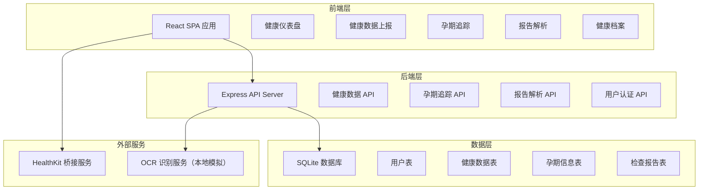
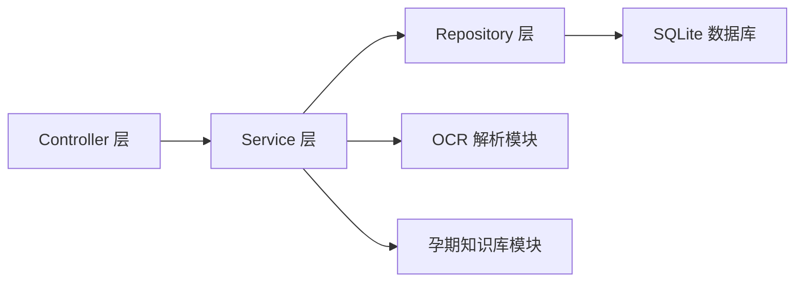
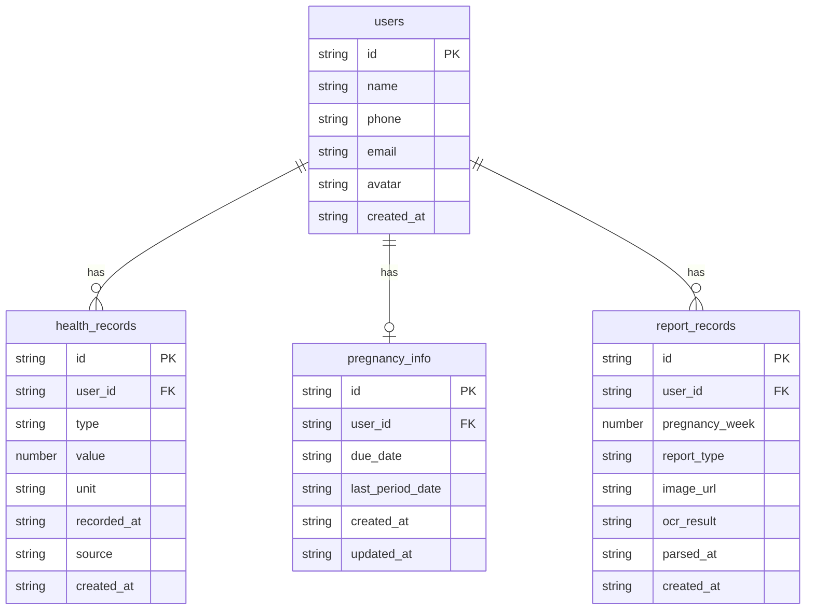

# 孕婴健康守护平台 - 技术架构文档

## 1. 架构设计



## 2. 技术说明
- 前端：React@18 + TypeScript + Tailwind CSS@3 + Vite
- 初始化工具：vite-init (react-express-ts 模板)
- 后端：Express@4 + TypeScript (ESM)
- 数据库：SQLite（通过 better-sqlite3）
- 状态管理：Zustand
- 图表库：Recharts
- 路由：react-router-dom
- 图标：lucide-react

## 3. 路由定义
| 路由 | 用途 |
|------|------|
| / | 健康仪表盘 - 主页概览 |
| /health | 健康数据上报 - 数据录入与设备同步 |
| /pregnancy | 孕期追踪 - 孕周进度与注意事项 |
| /pregnancy/:week | 具体孕周详情 |
| /report | 报告解析 - 上传与识别 |
| /report/:id | 报告详情 |
| /archive | 健康档案 - 历史数据与报告 |

## 4. API 定义

### 4.1 健康数据 API
```typescript
// 获取健康数据列表
GET /api/health?startDate=string&endDate=string&type=string
Response: { data: HealthRecord[] }

// 创建健康数据
POST /api/health
Body: { type: string; value: number; unit: string; recordedAt: string; source: "manual" | "apple_watch" | "iphone" }
Response: { data: HealthRecord }

// 获取健康数据趋势
GET /api/health/trend?type=string&days=number
Response: { data: TrendDataPoint[] }

// 同步 Apple 设备数据（模拟）
POST /api/health/sync
Body: { deviceType: "apple_watch" | "iphone"; dataType: string[] }
Response: { data: HealthRecord[]; syncedCount: number }
```

### 4.2 孕期追踪 API
```typescript
// 获取/设置孕期信息
GET /api/pregnancy
Response: { data: PregnancyInfo }

PUT /api/pregnancy
Body: { dueDate: string; lastPeriodDate: string }
Response: { data: PregnancyInfo }

// 获取指定孕周信息
GET /api/pregnancy/week/:week
Response: { data: WeekInfo }

// 获取产检时间表
GET /api/pregnancy/checkup-schedule
Response: { data: CheckupItem[] }
```

### 4.3 报告解析 API
```typescript
// 上传检查报告
POST /api/report/upload
Body: FormData { file: File; pregnancyWeek: number }
Response: { data: ReportRecord }

// 获取报告列表
GET /api/report
Response: { data: ReportRecord[] }

// 获取报告详情
GET /api/report/:id
Response: { data: ReportDetail }

// 重新解析报告
POST /api/report/:id/reparse
Response: { data: ReportDetail }
```

### 4.4 数据类型定义
```typescript
interface HealthRecord {
  id: string;
  userId: string;
  type: "heart_rate" | "steps" | "sleep" | "blood_oxygen" | "weight" | "blood_pressure" | "blood_sugar" | "temperature";
  value: number;
  unit: string;
  recordedAt: string;
  source: "manual" | "apple_watch" | "iphone";
  createdAt: string;
}

interface PregnancyInfo {
  id: string;
  userId: string;
  dueDate: string;
  lastPeriodDate: string;
  currentWeek: number;
  currentDay: number;
  createdAt: string;
}

interface WeekInfo {
  week: number;
  babySize: string;
  babySizeCn: string;
  babyWeight: string;
  babyLength: string;
  developments: string[];
  motherChanges: string[];
  dietAdvice: string[];
  exerciseAdvice: string[];
  warnings: string[];
  checkupItems: string[];
}

interface ReportRecord {
  id: string;
  userId: string;
  pregnancyWeek: number;
  reportType: string;
  imageUrl: string;
  ocrResult: OcrItem[];
  parsedAt: string;
  createdAt: string;
}

interface OcrItem {
  name: string;
  value: string;
  unit: string;
  referenceRange: string;
  isAbnormal: boolean;
  interpretation: string;
}

interface CheckupItem {
  week: number;
  name: string;
  description: string;
  isRequired: boolean;
}
```

## 5. 服务端架构图



## 6. 数据模型

### 6.1 数据模型定义



### 6.2 数据定义语言
```sql
CREATE TABLE users (
  id TEXT PRIMARY KEY DEFAULT (lower(hex(randomblob(16)))),
  name TEXT NOT NULL,
  phone TEXT,
  email TEXT,
  avatar TEXT,
  created_at TEXT NOT NULL DEFAULT (datetime('now'))
);

CREATE TABLE health_records (
  id TEXT PRIMARY KEY DEFAULT (lower(hex(randomblob(16)))),
  user_id TEXT NOT NULL REFERENCES users(id),
  type TEXT NOT NULL CHECK(type IN ('heart_rate', 'steps', 'sleep', 'blood_oxygen', 'weight', 'blood_pressure', 'blood_sugar', 'temperature')),
  value REAL NOT NULL,
  unit TEXT NOT NULL,
  recorded_at TEXT NOT NULL,
  source TEXT NOT NULL CHECK(source IN ('manual', 'apple_watch', 'iphone')),
  created_at TEXT NOT NULL DEFAULT (datetime('now'))
);

CREATE TABLE pregnancy_info (
  id TEXT PRIMARY KEY DEFAULT (lower(hex(randomblob(16)))),
  user_id TEXT NOT NULL UNIQUE REFERENCES users(id),
  due_date TEXT NOT NULL,
  last_period_date TEXT NOT NULL,
  created_at TEXT NOT NULL DEFAULT (datetime('now')),
  updated_at TEXT NOT NULL DEFAULT (datetime('now'))
);

CREATE TABLE report_records (
  id TEXT PRIMARY KEY DEFAULT (lower(hex(randomblob(16)))),
  user_id TEXT NOT NULL REFERENCES users(id),
  pregnancy_week INTEGER NOT NULL CHECK(pregnancy_week >= 1 AND pregnancy_week <= 42),
  report_type TEXT NOT NULL,
  image_url TEXT NOT NULL,
  ocr_result TEXT NOT NULL DEFAULT '[]',
  parsed_at TEXT,
  created_at TEXT NOT NULL DEFAULT (datetime('now'))
);

CREATE INDEX idx_health_records_user_type ON health_records(user_id, type);
CREATE INDEX idx_health_records_recorded_at ON health_records(recorded_at);
CREATE INDEX idx_report_records_user ON report_records(user_id);

-- 初始用户数据
INSERT INTO users (id, name, phone, email) VALUES ('demo-user-001', '准妈妈小美', '13800138000', 'demo@health.com');

-- 初始孕期信息
INSERT INTO pregnancy_info (id, user_id, due_date, last_period_date) VALUES ('preg-001', 'demo-user-001', '2026-12-15', '2026-03-10');
```
